<h1 align="center">
  <a href="https://git.io/typing-svg">
    
  </a>
</h1>

<p align="center">
  <a href="https://www.linkedin.com/in/rafaelborks/"></a>
  <a href="https://x.com/rafaelborks"></a>
  
</p>

---

### About me

```yaml
name: Rafael Borges
location: São Paulo, Brazil
role: Regional VP / Director
passions:
  - Writing code across many languages
  - Home Automation & IoT
  - 3D Printing & DIY hardware
  - Home Lab infrastructure
  - Open Source tooling
fun_fact: Graduated musician who found a second calling in tech
```

---

### Tech stack

<p align="center">
  
  
  
  
  
  
  
  
  
  
  
  
  
  
  
  
  
  
  
</p>

---

### Featured projects

<p align="center">
  <a href="https://github.com/borger/scoop-galaxy-integrations">
    
  </a>
  <a href="https://github.com/borger/scoop-emulators">
    
  </a>
</p>

---

### GitHub stats

<p align="center">
  
  
</p>

<p align="center">
  
</p>

<p align="center">
  
</p>

---

### Contribution snake

<picture>
  <source media="(prefers-color-scheme: dark)" srcset="./profile/snake-dark.svg" />
  <source media="(prefers-color-scheme: light)" srcset="./profile/snake.svg" />
  
</picture>
